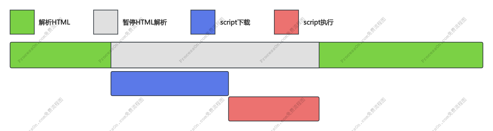
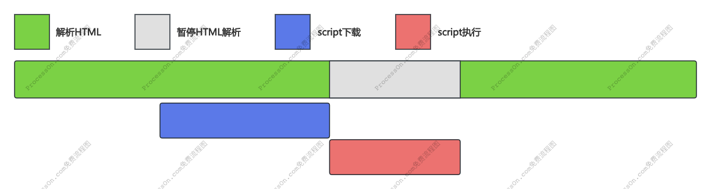
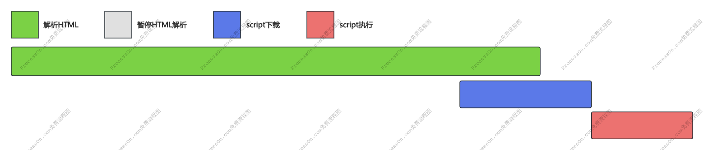
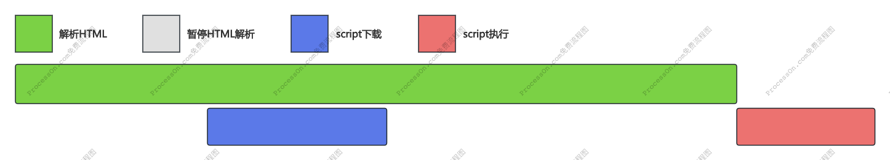

### script 标签 async&defer 属性

#### script

浏览器在解析 HTML 的时候，遇到普通的 script 标签，就会暂停解析，先发送网络请求下载 script 脚本的内容，然后让 js 引擎执行该代码，当代码执行完毕后，恢复解析 HTML。

#### async script

async 表示异步，浏览器在解析 HTML 的时候，遇到 async 属性的 script 标签，通知网络进程去下载 script 的资源，不会阻塞浏览器解析 HTML，当 script 资源下载完毕通知渲染进程，若此时 HTML 还没有解析完，浏览器会暂停解析，先让 JS 引擎执行代码，执行完毕后再进行解析，若此时 HTML 已经解析完，立即执行 JS 代码，此情况则不阻塞 HTML 解析。

#### defer script

defer 表示延迟，浏览器在解析 HTML 的时候，遇到 defer 属性的 script 标签，通知网络进程去下载 script 的资源，不会阻塞浏览器解析 HTML，当 script 资源下载完毕通知渲染进程，若此时 HTML 还没有解析完，则等待 HTML 解析完毕后再执行 JS 代码。

### 总结

| script 标签    |   JS 执行顺序    | 是否阻塞解析 HTML      |
| -------------- | :--------------: | ---------------------- |
| <script>       | 在 HTML 中的顺序 | 阻塞                   |
| <script async> | 网络请求返回顺序 | 可能阻塞，也可能不阻塞 |
| <script defer> | 在 HTML 中的顺序 | 不阻塞                 |
