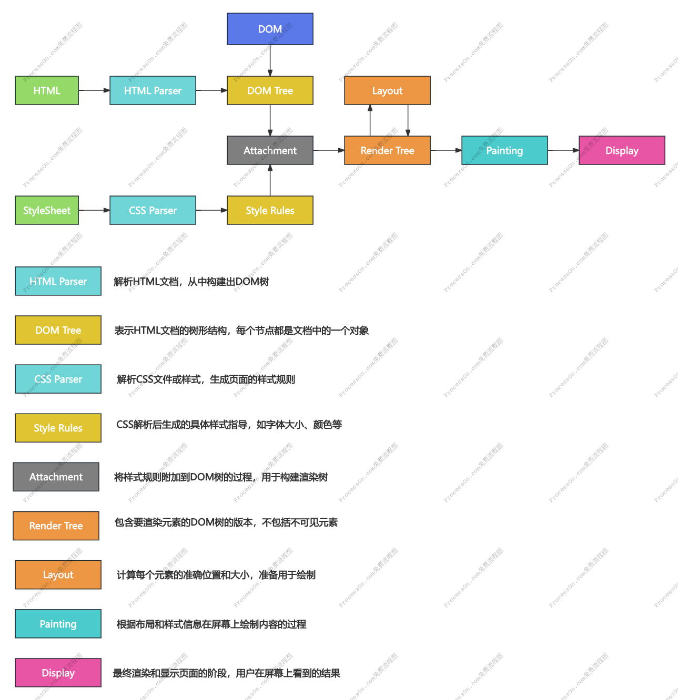

### 浏览器是如何渲染页面的？

当浏览器的网络线程收到 html 文档后，会产生一个渲染任务，并将其传递给渲染主线程的消息队列。
在事件循环机制的作用下，渲染主线程取出消息队列中的渲染任务，开启渲染流程。

1. 解析 HTML 文件，构建 DOM（文档对象模型）树。这个树代表了页面上所有元素的节点结构。
2. 解析 CSS 文件，构建 CSSOM 树。
3. 将 DOM 树和 CSSOM 树合并成渲染树。
4. 生成布局树，计算每个元素在页面上的位置和大小。
5. 根据布局绘制渲染树，将渲染树上的元素绘制成屏幕上的像素。
6. 合成层，将多个图层合并成一个图层，以便使用 GPU 进行加速。
7. 使用 GPU 加速，对图层进行合成，形成最终的图像。

### 回流和重绘

#### 回流

回流是浏览器为了重新渲染部分或全部文档而重新计算文档中元素的位置和几何结构的过程。它通常是因为元素的尺寸、布局、隐藏等属性发生变化引起的。

理解回流 reflow：（也可以称之为重排）

1. 第一次确定节点的大小和位置，称之为布局（layout）。
2. 之后对节点的大小、位置修改重新计算称之为回流。

触发回流:

1. DOM 结构的变化，比如添加、删除、移动元素等操作
2. 改变元素的布局，比如修改元素的宽高、padding、margin、border、position、display 等属性
3. 页面的尺寸变化，比如浏览器窗口大小的变化，或者文档视口的变化
4. 获取元素的几何属性，比如调用 getComputedStyle() 方法获取元素的尺寸、位置等信息

#### 重绘

重绘是当页面中元素样式的改变并不影响它在文档流中的位置时（如 color、background-color、visibility 等），浏览器将重新绘制这些元素的过程

理解重绘 repaint:

1. 第一次渲染内容称之为绘制（paint）
2. 之后重新渲染称之为重绘

触发重绘:

1. 修改元素的颜色、背景色、边框颜色、文本样式等属性
2. 修改元素的 box-shadow、text-shadow、outline 等属性
3. 使用 CSS3 transform 和 opacity 等属性
4. 添加、移除、修改元素的 class
5. 使用 JavaScript 直接修改样式

**回流一定会引起重绘，所以回流是一件很消耗性能的事情**
